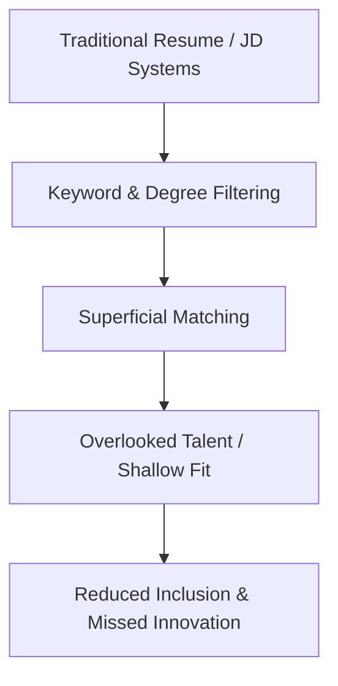
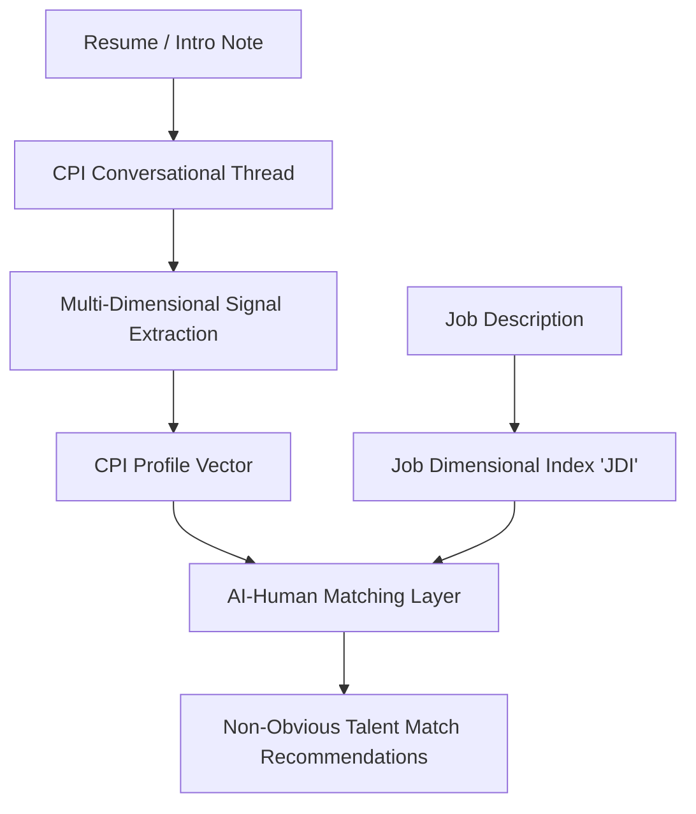
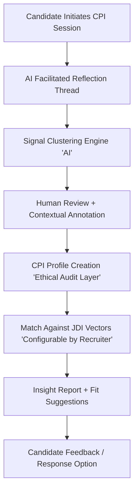

# **Towards an Ethical Cognitive-Presence Index (CPI)**

## **Abstract**

In an era where resumes and job titles often **fail to reveal real human capability**, a deeper and more ethical talent discovery approach is needed.  
This whitepaper proposes the **Cognitive-Presence Index (CPI)** — a **multi-dimensional, human-first framework** that blends **AI-assisted reflection** with **human judgement** to uncover cognitive depth, ethical reasoning, and adaptive learning potential.  

CPI is **not a ranking engine**, but a **discovery engine**, co-created with human insight rather than algorithmic scoring.

---

## **Background: Current Hiring Practices**

The **current talent acquisition ecosystem** largely relies on:

- **Document-first screening** — resumes, cover letters, and static profiles  
- **Automated keyword filtering** — job portals and applicant tracking systems rely on pre-set terms  
- **One-dimensional assessments** — short interviews, standardized tests, and personality quizzes  

**Challenges with current methods:**

- They **prioritize surface attributes** (titles, degrees, keywords) over real cognitive ability  
- They **filter out unconventional candidates**, career-break professionals, and polymaths  
- They **fail to measure** how a person **thinks, learns, or adapts in evolving contexts**  

> **Observation:** The focus is on **credential compliance**, not **cognitive presence or ethical reasoning**.

---

## **Problem Landscape**

Traditional hiring mechanisms:

- **Overlook latent talent** hidden in non-linear career paths  
- **Reinforce bias** by over-weighting standard credentials  
- **Reduce inclusion and innovation**, missing candidates who think differently  

Organisations **lack a reflective mechanism** to:

- Capture **long-form thinking** and **learning agility**  
- Understand **ethical reasoning** and **empathy**  
- Identify **non-obvious talent alignment**   
- Fail to capture how a person **thinks, adapts, and evolves**  

### **Diagram 1: Traditional Hiring Problem**

## **Introducing the Job Dimensional Index (JDI)**

Before defining the **Cognitive-Presence Index (CPI)**, it’s critical to understand **JDI**:

**Job Dimensional Index (JDI)** is a **multi-axis profile of a job role**, capturing:

1. **Core Functional Requirements** (skills, domain expertise)
2. **Cognitive Requirements** (analytical reasoning, problem-solving agility)
3. **Behavioural Expectations** (communication style, empathy, adaptability)
4. **Ethical & Cultural Dimensions** (bias-awareness, integrity, collaboration ethos)

> **Purpose of JDI:**
>
> - Move **beyond job titles** to **multi-dimensional job understanding**
> - Enable **matching with CPI profiles** based on **thinking and behavioral patterns**, not just experience keywords

This **CPI + JDI pairing** forms the backbone of a **human-first, AI-assisted discovery model**.

## **Cognitive-Presence Index (CPI) Overview**

**CPI is a reflective, opt-in framework** that:

- Analyses **long-form conversational intelligence**
- Tracks **clarity, ethics, empathy, and cognitive agility**
- Offers individuals a **mirror for self-discovery**
- Provides organizations **non-obvious talent matches**

### **Diagram 2: CPI + JDI Matching Framework**

------

## **CPI Dimensions**

| Dimension                 | Description                                        |
| ------------------------- | -------------------------------------------------- |
| **Clarity of Thought**    | Ability to reason, structure, and articulate ideas |
| **Domain Depth**          | Insight across one or more specialized topics      |
| **Communication Agility** | Contextual tone and adaptive expression            |
| **Ethical Orientation**   | Transparency, fairness, moral reasoning            |
| **Empathy**               | Sensitivity to other perspectives                  |
| **Reflective Learning**   | Evidence of evolving understanding over time       |
| **Bias Awareness**        | Capacity to notice and correct blind spots         |

> **Note:** Each dimension is assessed through **conversation, human review, and reflective annotation** — not rigid automation.

------

## **Governance & Ethical Assurance**

CPI operates under a **neutral governance model** called the **CPI Commons**:

- Composed of **ethics, HR, AI, education, and labor rights experts**
- Maintains **open-source CPI/JDI standards**
- Provides **audit-able and challenge mechanisms** for candidates
- Mandates **transparent interpretation** for recruiters
- Supports **inclusion and bias mitigation** as configurable criteria

> **Analogy:** This is to talent discovery what **Creative Commons** is to content — a **neutral, public-interest standard**, not corporate-owned.

------

## **Illustrative Case Studies**

### **Case 1: Unlocking Hidden Talent**

- A trained ophthalmologist **opts into CPI**
- Reflective sessions reveal **high ethical reasoning** and **rare perceptual skills**
- **JDI alignment** with an **AI ethics review organization** highlights a **non-obvious career match**

Result: The candidate finds **new career pathways**, and the organization gains **unique cognitive diversity**.

------

### **Case 2: Rediscovering Value after a Career Break**

- A professional returning after **5-year parental break**
- CPI shows **strong clarity of thought**, **adaptive communication**, and **leadership traits**
- Matched with **project liaison role** in a **social impact startup**

Result: Organisation **bypasses rigid experience filters** and welcomes **high-alignment talent**.

------

## **Human-AI Governance Loop**

The CPI process emphasizes **human-in-the-loop validation**:

**Key Principle:** AI **assists in clustering** and signal extraction, but **human review and contextual interpretation** remain the **final authority**.

------

## **Road map & Next Steps**

- Develop **open-source tooling** for CPI/JDI index generation
- Build **interactive CPI self-reflection portal**
- Collaborate with **educational & hiring partners** for pilot studies
- Establish a **neutral, community-driven CPI Commons governance**

------

## **Conclusion**

The **future of work** demands **more than credentials**.
 It requires **cognitive presence** — **the human capacity to reason, reflect, and evolve**, ethically amplified by AI.

CPI is not a test.
 It’s a **conversation** — **human-centered, context-aware, and ethically guided**.

 *Whitepaper authored by Kathiravan Muthaiah.  
Structured with AI-assisted review for clarity and readability.*
