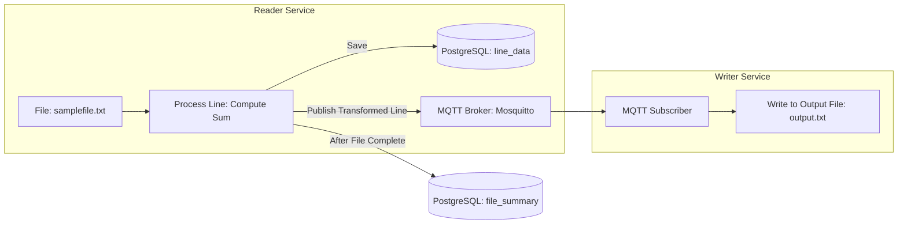

# Series: Reactive File Processing with MQTT: Spring Boot vs Quarkus - Part 1 Introduction

## **1. Project Overview**

The **Reactive MQTT File Pipeline** is a hands-on learning project that demonstrates:

- **Asynchronous file processing** using **Reactive Streams** (Spring Flux and Quarkus Mutiny)
- **Event-driven communication** using **MQTT (Mosquitto)**
- **Persistence** of raw and transformed data in **PostgreSQL**
- **Multi-framework comparison**: **Spring Boot 3.2** vs **Quarkus 3.8**

This project is built to **learn and compare**:

1. Reactive frameworks (`Flux` vs `Mutiny`)
2. Application architecture in **Spring Boot vs Quarkus**
3. Real-time messaging using **MQTT**
4. Database handling with **JPA & JDBC**
5. **Docker-based microservice setup** for local testing

------

## **2. Learning Objectives**

By following this series and the GitHub repo, you will learn:

1. How to **read and process files reactively** in Java:
   - Using **Spring Flux** and **Quarkus Mutiny**
2. How to **publish and consume messages** using **MQTT (Mosquitto)**:
   - Event-driven approach to decouple Reader and Writer services
3. How to **persist data** using:
   - **Spring JPA + JdbcTemplate**
   - **Quarkus Panache + JDBC**
4. How to **compare Spring Boot and Quarkus implementations** in:
   - Configuration management
   - Dependency Injection
   - Reactive programming styles
5. How to **dockerize and orchestrate microservices** with:
   - PostgreSQL
   - Mosquitto MQTT
   - Reader & Writer services (both Spring and Quarkus)

------

## **3. Architecture Diagram**

Here’s the **high-level flow** of the pipeline:



- **Reader Service**:
  - Reads CSV-like input file
  - Transforms each line → append sum
  - Saves to DB & publishes to MQTT
  - After completion, writes summary record (file name & line count)
- **Writer Service**:
  - Subscribes to MQTT topic
  - Writes transformed lines to output file asynchronously

------

## **4. Tech Stack & Environment Setup**

### **Languages & Frameworks**

- **Java 17**
- **Spring Boot 3.2**
  - Project Reactor (Flux)
  - JPA + JdbcTemplate
- **Quarkus 3.8**
  - Mutiny (Multi / Uni)
  - Panache Repository + JDBC
- **Eclipse Paho MQTT Client**

------

### **Infrastructure**

- **PostgreSQL 15** (external via Docker)
- **Mosquitto MQTT Broker** (external via Docker)
- **Docker Compose** for orchestrating services
- `.env` file for environment variables

------

### **Repository Modules**

```text
reactive-mqtt-file-pipeline/
│
├── reader-springboot/   # Spring Boot Reader
├── writer-springboot/   # Spring Boot Writer
├── reader-quarkus/      # Quarkus Reader (Plain, Flux, Mutiny)
├── writer-quarkus/      # (Optional, for future)
├── docker-volume/       # Logs & file mounts
├── PGschema.sql         # DB schema for line_data & file_summary
├── docker-compose.*.yaml
└── README.md
```

------

### **Database Schema**

- **line_data**: stores raw and transformed lines
- **file_summary**: stores file name and total line count

See [`PGschema.sql`](https://github.com/KathiravanMuthaiah/reactive-mqtt-file-pipeline/blob/main/supportScripts/PGschema.sql) for exact DDL.

------

### **Environment Setup**

1. Clone the repository:

   ```bash
   git clone https://github.com/KathiravanMuthaiah/reactive-mqtt-file-pipeline.git
   cd reactive-mqtt-file-pipeline
   ```

2. Prepare `.env` for local Docker Compose:

   ```text
   POSTGRES_USER=postgres
   POSTGRES_PASSWORD=postgres
   POSTGRES_DB=fileproc
   POSTGRES_HOST=host.docker.internal
   POSTGRES_PORT=5432
   
   MQTT_BROKER_HOST=host.docker.internal
   MQTT_TOPIC=file.processed.line
   ```

3. Start infrastructure:

   ```bash
   docker compose -f docker-compose.reader-springboot.yaml up -d
   ```

------

### **GitHub Repository Link**

🔗 **Project Repo:**
 https://github.com/KathiravanMuthaiah/reactive-mqtt-file-pipeline

